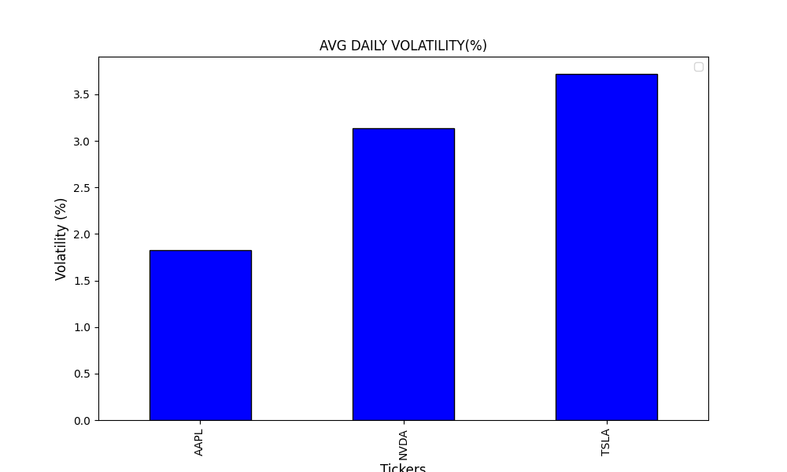

# EQUITY MARKET MOVEMENT VISUALIZER

## Overview
A lightweight Python utility script built for rapid Exploratory Data Analysis (EDA) of global equities. Before feeding assets into heavier algorithmic models or statistical arbitrage engines, this tool quickly fetches historical market data, calculates risk metrics, and visualizes the volatility/return profiles of multiple tickers simultaneously.

## The Visualizations
Running this script generates a sequence of 5 core EDA charts:

### 1. Stock Price Trend
Adjusted closing prices over the selected timeframe.


### 2. Average Daily Return
Bar chart comparing the mean percentage return across assets.


### 3. Average Daily Volatility
Bar chart comparing the standard deviation (risk) of each asset.


### 4. Risk v/s Return Scatter Plot
The core analytical chart plotting each ticker on an X/Y axis of Volatility vs. Return, complete with mean baselines to quickly identify optimal risk-adjusted assets.


### 5. Volume Period
Daily trading volume trends to identify liquidity spikes.


## Tech Stack
* **Language:** Python
* **Libraries:** `yfinance`, `matplotlib`

## How to Run
Run the script directly in your terminal. You will be prompted to enter the desired tickers, start date, and end date. 

```bash
python equity_EDA_visualizer.py
```
